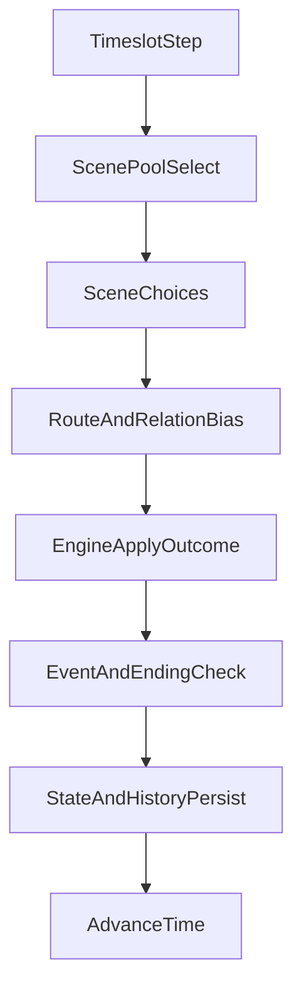

# Galgame Scene-Route Refactor Plan

## Target Outcome
Replace the current flat `8`-action loop with a Galgame-oriented flow: `timeslot -> scene -> subchoice -> consequence`, plus route pressure/relationship dynamics inspired by Endless Eight-style repetition and character tension.

## Chosen Constraints
- Scope: full-stack (`engine + TUI + CLI`) in one roadmap.
- Compatibility: breaking changes are acceptable (old saves/IDs may be retired).
- Delivery style: staged, but all stages designed for eventual full-stack parity.

## Current Architecture Baseline
- Action source and resolution: [src/haruhiloop_cli/rules.py](/home/virtualguard/vg101/dev/haruhiloop/src/haruhiloop_cli/rules.py) (`ACTIONS`, `ORDERED_ACTION_IDS`, `resolve_action_ref`, `get_available_actions`).
- Execution pipeline: [src/haruhiloop_cli/engine.py](/home/virtualguard/vg101/dev/haruhiloop/src/haruhiloop_cli/engine.py) (`GameEngine.step`).
- State model/persistence payload: [src/haruhiloop_cli/models.py](/home/virtualguard/vg101/dev/haruhiloop/src/haruhiloop_cli/models.py), [src/haruhiloop_cli/storage.py](/home/virtualguard/vg101/dev/haruhiloop/src/haruhiloop_cli/storage.py).
- Full-stack UI entrypoints: [src/haruhiloop_cli/play_app.py](/home/virtualguard/vg101/dev/haruhiloop/src/haruhiloop_cli/play_app.py), [src/haruhiloop_cli/main.py](/home/virtualguard/vg101/dev/haruhiloop/src/haruhiloop_cli/main.py), [src/haruhiloop_cli/view.py](/home/virtualguard/vg101/dev/haruhiloop/src/haruhiloop_cli/view.py).

## Refactor Shape

## Phase 1: Domain Model Replacement (Engine Foundation)
- Introduce scene-choice domain in [src/haruhiloop_cli/models.py](/home/virtualguard/vg101/dev/haruhiloop/src/haruhiloop_cli/models.py):
  - New structs (or equivalent typed dicts): `Scene`, `SceneChoice`, `ChoiceOutcome`, `RouteState`.
  - Extend `GameState` with route/relationship context (e.g. `active_route`, `route_progress`, per-character affinity/tension).
- Replace flat action table in [src/haruhiloop_cli/rules.py](/home/virtualguard/vg101/dev/haruhiloop/src/haruhiloop_cli/rules.py):
  - Add `SCENE_POOLS_BY_TIMESLOT` and scene-conditioned choice sets.
  - Remove/retire `老实上课`; add summer-consistent baseline choices (e.g. `例行集合`, `在家消磨`, `社区闲逛`, `补习/作业推进`).
  - Replace `resolve_action_ref` with a two-step resolver (`scene_ref`, `choice_ref`) and keep a compatibility shim only for transition testing.
- Update execution contract in [src/haruhiloop_cli/engine.py](/home/virtualguard/vg101/dev/haruhiloop/src/haruhiloop_cli/engine.py):
  - Add `available_scenes(state)` and `available_choices(state, scene_id)`.
  - Change `step(...)` input from single `action_id` to scene+choice command object.
  - Keep current subsystem hooks (`homework/crew/closed_space/memory`) but route them through `ChoiceOutcome`.

## Phase 2: Narrative and Progression Systems
- Rebuild flavor/event binding around scene+choice in [src/haruhiloop_cli/action_flavor_zh.py](/home/virtualguard/vg101/dev/haruhiloop/src/haruhiloop_cli/action_flavor_zh.py):
  - Scene-specific prose pools, route-sensitive variants, repetition-aware anti-fatigue policy.
- Rework ending and event gates in [src/haruhiloop_cli/rules.py](/home/virtualguard/vg101/dev/haruhiloop/src/haruhiloop_cli/rules.py):
  - Shift hard gates from old action/category counters to route milestones + key flags + relationship thresholds.
  - Preserve narrative intent of current endings while remapping triggers to the new domain.
- Refresh ending descriptors and cheat text in [src/haruhiloop_cli/ending_epilogues.py](/home/virtualguard/vg101/dev/haruhiloop/src/haruhiloop_cli/ending_epilogues.py) and [src/haruhiloop_cli/ending_conditions_zh.py](/home/virtualguard/vg101/dev/haruhiloop/src/haruhiloop_cli/ending_conditions_zh.py).

## Phase 3: Full-stack Input/UX Migration
- TUI migration in [src/haruhiloop_cli/play_app.py](/home/virtualguard/vg101/dev/haruhiloop/src/haruhiloop_cli/play_app.py):
  - Replace single numeric selection with a two-stage loop: `select scene -> select choice -> confirm`.
  - Add explicit breadcrumb state in the main panel (current timeslot, chosen scene, pending choice).
- View rendering updates in [src/haruhiloop_cli/view.py](/home/virtualguard/vg101/dev/haruhiloop/src/haruhiloop_cli/view.py):
  - Replace old action table with scene and choice tables.
  - Update step summary labels from “动作” to “场景/选择”.
- CLI migration in [src/haruhiloop_cli/main.py](/home/virtualguard/vg101/dev/haruhiloop/src/haruhiloop_cli/main.py):
  - Replace `step run_id action_ref` with either:
    - `step run_id --scene <scene_ref> --choice <choice_ref>`, or
    - guided mode command (`scene`, `choose`, `confirm`) for parity with TUI.
  - Update help text and examples in command docs.

## Phase 4: Persistence and Break Strategy
- Introduce storage versioning in [src/haruhiloop_cli/storage.py](/home/virtualguard/vg101/dev/haruhiloop/src/haruhiloop_cli/storage.py):
  - Add explicit schema version field for new runs.
  - Since breakage is allowed, fail fast with clear error when loading legacy runs; optionally provide one-shot archive command later.
- Update `StepRecord` shape in [src/haruhiloop_cli/models.py](/home/virtualguard/vg101/dev/haruhiloop/src/haruhiloop_cli/models.py):
  - Store `scene_id`, `scene_label`, `choice_id`, `choice_label` (retire `action_id/action_label`).

## Phase 5: Test and Documentation Rewrite
- Replace tests tied to flat action IDs:
  - [tests/test_engine.py](/home/virtualguard/vg101/dev/haruhiloop/tests/test_engine.py)
  - [tests/test_action_flavor.py](/home/virtualguard/vg101/dev/haruhiloop/tests/test_action_flavor.py)
  - [tests/test_endings.py](/home/virtualguard/vg101/dev/haruhiloop/tests/test_endings.py)
  - [tests/test_systems_v03.py](/home/virtualguard/vg101/dev/haruhiloop/tests/test_systems_v03.py)
- Add new coverage:
  - scene availability by timeslot/flags,
  - choice availability by route state,
  - route milestone progression,
  - TUI two-stage selection behavior,
  - CLI new step syntax and error messages.
- Update docs:
  - [docs/arch.md](/home/virtualguard/vg101/dev/haruhiloop/docs/arch.md)
  - [docs/dev.md](/home/virtualguard/vg101/dev/haruhiloop/docs/dev.md)
  - [docs/getting-started.md](/home/virtualguard/vg101/dev/haruhiloop/docs/getting-started.md)
  - [docs/tui-play-memo.md](/home/virtualguard/vg101/dev/haruhiloop/docs/tui-play-memo.md)

## Acceptance Criteria by Milestone
- M1 Engine foundation done when: no core path depends on `ORDERED_ACTION_IDS` flat list.
- M2 narrative systems done when: at least 3 scenes per timeslot and route-sensitive outcomes are active.
- M3 interface migration done when: both TUI and CLI can complete full runs with scene+choice input only.
- M4 quality gate done when: full test suite passes and docs no longer mention fixed 8-choice loop.