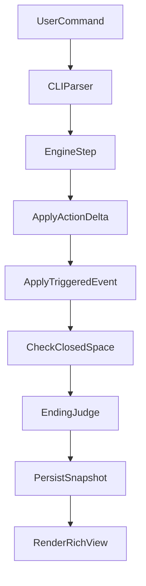

# Haruhi 时间循环 CLI 规划

## 目标与边界
- 交付可运行 CLI 原型：包含循环推进、状态变化、闭锁空间触发、多结局判定、回放分析。
- 技术路线：`规则状态机 + RL接口预留`（不在首版实现完整训练流程）。
- 48 小时优先级：`主玩法闭环 > 可观测性与可回放 > 自动模拟（有时间再做）`。

## 目录与模块划分
- 入口与命令：[`/home/virtualguard/vg101/dev/haruhi/src/haruhi_cli/main.py`](/home/virtualguard/vg101/dev/haruhi/src/haruhi_cli/main.py)
- 状态模型：[`/home/virtualguard/vg101/dev/haruhi/src/haruhi_cli/models.py`](/home/virtualguard/vg101/dev/haruhi/src/haruhi_cli/models.py)
- 状态机引擎：[`/home/virtualguard/vg101/dev/haruhi/src/haruhi_cli/engine.py`](/home/virtualguard/vg101/dev/haruhi/src/haruhi_cli/engine.py)
- 事件与结局规则：[`/home/virtualguard/vg101/dev/haruhi/src/haruhi_cli/rules.py`](/home/virtualguard/vg101/dev/haruhi/src/haruhi_cli/rules.py)
- 持久化与回放：[`/home/virtualguard/vg101/dev/haruhi/src/haruhi_cli/storage.py`](/home/virtualguard/vg101/dev/haruhi/src/haruhi_cli/storage.py)
- 输出展示（Rich）：[`/home/virtualguard/vg101/dev/haruhi/src/haruhi_cli/view.py`](/home/virtualguard/vg101/dev/haruhi/src/haruhi_cli/view.py)
- RL 兼容接口：[`/home/virtualguard/vg101/dev/haruhi/src/haruhi_cli/policy.py`](/home/virtualguard/vg101/dev/haruhi/src/haruhi_cli/policy.py)
- 测试：[`/home/virtualguard/vg101/dev/haruhi/tests/test_engine.py`](/home/virtualguard/vg101/dev/haruhi/tests/test_engine.py), [`/home/virtualguard/vg101/dev/haruhi/tests/test_endings.py`](/home/virtualguard/vg101/dev/haruhi/tests/test_endings.py)

## 核心机制设计
- 状态变量（最小集）：`loop_count`, `day`, `timeslot`, `satisfaction`, `stability`, `clue_points`, `flags`。
- 每回合流程：玩家选择行动 -> 应用动作增量 -> 触发事件修正 -> 判定是否进入闭锁空间 -> 判定结局/继续循环。
- 闭锁空间触发：`stability` 低于阈值触发高风险事件池；失败会加剧下轮世界线偏移。
- 多结局（首版至少3个）：
  - `haruhi_happy_new_world`：满意度高+关键线索齐备。
  - `kyon_breaks_loop`：满足破局动作序列。
  - `shinirappears_unstable_world`：满意度低且稳定性崩溃。
- 可扩展性：规则配置与事件池分离，新增结局只改 `rules.py` 与配置对象，不改引擎主循环。

## 命令面与可观测性
- `start`：创建新 run 并初始化状态。
- `step --action <id>`：推进一个时段。
- `status`：打印当前状态和风险提示。
- `history [--last N]`：查看关键决策链。
- `replay <run_id>`：按时间线复盘，给出失败/成功原因。
- `simulate --runs N`（可选）：调用 `Policy` 接口批量模拟并输出成功率。

## 数据流（实现导向）

## 48 小时执行节奏
- 0-8h：初始化项目、命令骨架、状态模型、最小循环。
- 8-18h：事件系统、闭锁空间、基础结局判定。
- 18-28h：history/replay、日志落盘（JSONL）与可读输出。
- 28-36h：平衡参数、补充第二/第三结局、文案打磨。
- 36-44h：测试补齐（核心路径+边界条件）。
- 44-48h：演示脚本、录屏彩排、预案分支（无 simulate 的保底演示）。

## 测试与验收标准
- 引擎确定性：同输入序列得到同状态轨迹。
- 触发正确性：闭锁空间阈值与事件触发严格可复现。
- 结局正确性：三种结局判定互斥且可覆盖。
- 回放可解释：每轮至少输出动作、状态差分、触发事件。
- CLI 可用性：关键命令有帮助文案与错误提示。

## 风险与控制
- 风险：剧情分支过多导致规则爆炸。
- 控制：首版仅保留 1 条主线 + 1 套闭锁空间事件池；新增剧情通过配置扩展。
- 风险：临时引入 RL 训练导致不稳定。
- 控制：仅保留 `Policy` 接口与随机/启发式策略实现，把 RL 训练放在赛后扩展。