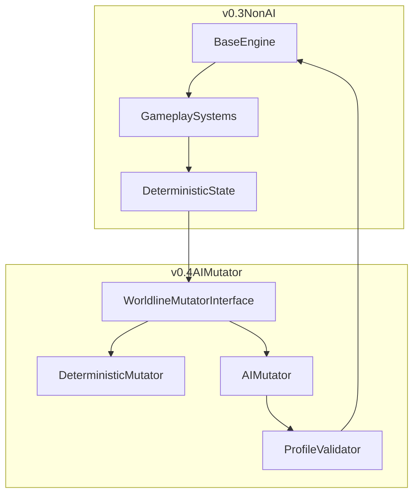

# 双版本迭代规划（玩法先行，AI后置）

## 目标与分版原则

- v0.3 仅引入你选定的四个非 AI 特性：作业任务链、团员协同、闭锁空间可操作事件流、循环记忆残留。
- v0.4 仅引入 AI 世界线扰动（Worldline Mutator），不与 v0.3 的核心规则重构同时上线。
- 保持“规则引擎决定结算、外部系统只做调制”的边界，避免可复现性和调试性下降。

## 现状基线（用于落点）

- 回合主流程集中在 [engine.py](/home/virtualguard/vg101/dev/haruhiloop/src/haruhiloop_cli/engine.py)：动作增量 -> 事件判定 -> 结局判定 -> 时段推进。
- 动作/事件/结局规则集中在 [rules.py](/home/virtualguard/vg101/dev/haruhiloop/src/haruhiloop_cli/rules.py)。
- 持久化模型在 [models.py](/home/virtualguard/vg101/dev/haruhiloop/src/haruhiloop_cli/models.py) 与 [storage.py](/home/virtualguard/vg101/dev/haruhiloop/src/haruhiloop_cli/storage.py)。
- CLI 入口在 [main.py](/home/virtualguard/vg101/dev/haruhiloop/src/haruhiloop_cli/main.py)，展示在 [view.py](/home/virtualguard/vg101/dev/haruhiloop/src/haruhiloop_cli/view.py)。
- 现有测试（确定性与结局）在 [test_engine.py](/home/virtualguard/vg101/dev/haruhiloop/tests/test_engine.py)、[test_endings.py](/home/virtualguard/vg101/dev/haruhiloop/tests/test_endings.py)。

## v0.3：非 AI 玩法扩展包（四特性同版）

### 1) 作业任务链（替代单 flag）

- 在 `GameState` 新增 `homework_progress`（0-3）与 `homework_parts_done`（如阅读/演算/提交）。
- 将“完成暑假作业”动作从一次性 `homework_done` 改为可重复推进；当进度达阈值再写入 `homework_done`。
- 新增至少 1 个与作业进度联动事件（例如夜间收尾压力），并与 `hope_signal` 条件兼容。

### 2) 团员协同系统

- 在 `GameState` 新增 `crew_sync`（总体协同值）和 `member_trust`（可选：按角色映射）。
- 在动作与事件中引入协同增减（如“同步循环真相”受协同影响更大）。
- 对关键动作增加“软门槛”：协同不足时仍可执行，但收益下降或附带风险，避免硬锁死。

### 3) 闭锁空间可操作事件流

- 将 `closed_space` 从单次惩罚扩为“危机阶段”状态（例如 `closed_space_stage`）。
- 在可用动作中增加危机应对语义（不必先扩大量新动作，可通过现有动作在危机态下变体结算）。
- 在 `view` 中明确展示危机阶段与当前最佳干预方向。

### 4) 循环记忆残留

- 在每次“新循环日”结算后，根据达成情况注入少量、可上限的残留加成（如线索效率或协同恢复）。
- 残留必须衰减或封顶，防止滚雪球破坏平衡。
- 保留默认确定性：残留计算纯规则化、无随机。

### v0.3 代码结构建议

- 新建 `systems` 层（如 `systems/homework.py`, `systems/crew.py`, `systems/closed_space.py`, `systems/memory.py`）承载子系统规则。
- `engine.step` 只负责调用顺序与状态提交，复杂规则下沉到子系统。
- `rules.py` 继续作为动作注册与基础条件入口，避免逻辑碎片化。

## v0.4：AI 世界线扰动（单特性独立上线）

### 核心能力

- 每个“循环日开始”计算一个 `worldline_mutation_profile`（如情绪敏感、稳定脆弱、线索放大）。
- 该 profile 只允许在设定范围内微调动作/事件系数，不允许直接改写结局判定函数。
- AI 输出失败或超界时，自动回退到 deterministic 默认 profile。

### 接口与边界

- 新增 `WorldlineMutator` 接口（例如 `mutate(state_snapshot) -> profile`），先提供 `DeterministicMutator` 作为基线实现。
- AI 实现（后续）包装为 `AIMutator`，输出结构化 JSON，经 schema 校验后生效。
- `engine` 只消费 profile，不感知 AI 细节；实现与引擎解耦。

### 可复现与调试

- CLI 增加 `--seed`、`--ai-temperature`（或配置项）用于可控探索。
- `history.jsonl` 增加 `mutation_profile` 字段，确保 replay 可解释。
- 为 AI 模式增加“回放一致性”策略：固定 seed + 固定模型参数时，profile 可重放。

## 版本衔接与防混乱措施

- 先完成 v0.3 的状态字段与测试稳定，再接入 v0.4 的 mutator 接口。
- v0.4 初期默认仍走 `DeterministicMutator`，AI 仅作为可开关实验模式。
- 文档分层更新：玩法文档先更新到 v0.3；AI 文档独立章节，标注实验性。

## 测试与验收

- 单元测试：四个子系统各自覆盖边界与阈值。
- 回归测试：保留现有结局测试并新增 v0.3 条件变体。
- 确定性测试：
  - v0.3：同输入同输出必须成立。
  - v0.4：DeterministicMutator 模式仍需成立；AI 模式验证“受控非确定性 + 可回退”。
- CLI 集成测试：`start/step/status/history/replay/simulate` 端到端跑通。

## 交付顺序（建议）

- 里程碑 A（v0.3-alpha）：模型扩展 + 作业任务链 + 基础测试。
- 里程碑 B（v0.3-beta）：团员协同 + 闭锁空间事件流 + UI 展示更新。
- 里程碑 C（v0.3-rc）：循环记忆残留 + 全量回归 + 文档更新。
- 里程碑 D（v0.4-alpha）：Mutator 接口 + DeterministicMutator + profile 持久化。
- 里程碑 E（v0.4-beta）：AIMutator 接入 + schema 校验 + seed/参数控制。
- 里程碑 F（v0.4-rc）：AI 模式观测与平衡调整，确定默认开关策略。