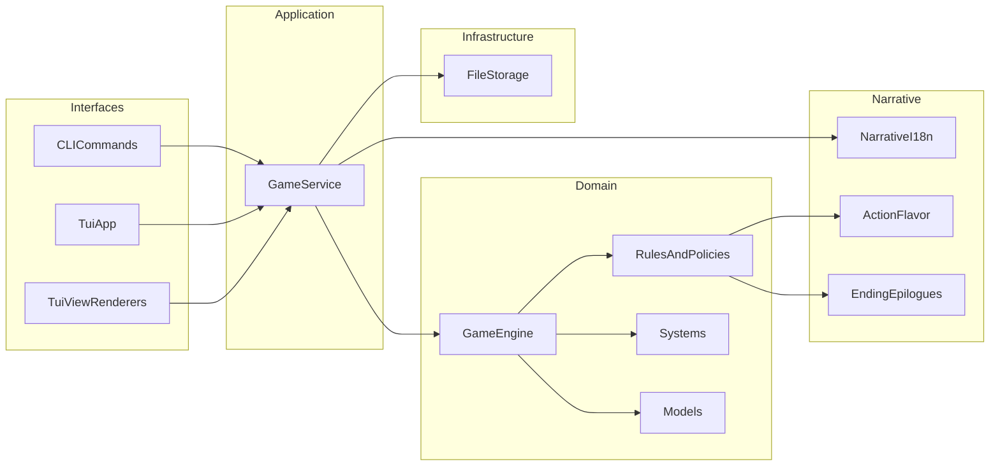

# src 模块工程化重构计划

## 目标
- 把当前 `src/haruhiloop_cli` 中“引擎、规则、UI、存储、文案”混杂的结构拆成清晰分层。
- 保持外部入口与导入路径稳定：`haruhiloop_cli.main:app`、`haruhiloop_cli.play_app:run_play`（见 [pyproject.toml](/home/virtualguard/vg101/dev/haruhiloop/pyproject.toml)）。
- 先做低风险重组（增加子包 + 兼容导出），再逐步收敛旧路径。

## 现状边界（重构依据）
- **入口层**：CLI 在 [src/haruhiloop_cli/main.py](/home/virtualguard/vg101/dev/haruhiloop/src/haruhiloop_cli/main.py)，TUI 在 [src/haruhiloop_cli/play_app.py](/home/virtualguard/vg101/dev/haruhiloop/src/haruhiloop_cli/play_app.py)。
- **核心编排**：`GameEngine` 在 [src/haruhiloop_cli/engine.py](/home/virtualguard/vg101/dev/haruhiloop/src/haruhiloop_cli/engine.py)，目前直接耦合 `rules`、`systems/*`、`mutator`、`i18n`。
- **表现层**：Rich 渲染在 [src/haruhiloop_cli/view.py](/home/virtualguard/vg101/dev/haruhiloop/src/haruhiloop_cli/view.py)。
- **测试依赖**：测试直接依赖 `haruhiloop_cli.*` 以及少量私有函数（如 `_toggle_view_mode`、`_apply_noise`），见 [tests/test_tui_hybrid_view.py](/home/virtualguard/vg101/dev/haruhiloop/tests/test_tui_hybrid_view.py)、[tests/test_quote_effects.py](/home/virtualguard/vg101/dev/haruhiloop/tests/test_quote_effects.py)。

## 目标分层与目录划分
- **interfaces（接口层）**：面向用户交互（CLI/TUI、终端渲染）。
- **application（应用层）**：用例编排（start/step/status/replay/simulate）、DTO/服务边界。
- **domain（领域层）**：实体、规则、系统机制、结局判定、策略选择核心。
- **infrastructure（基础设施层）**：持久化、外部适配（文件系统存档等）。
- **narrative（叙事资源层）**：文案、结局长剧情、动作 flavor、i18n。

## 建议目录树（第一阶段）
- `src/haruhiloop_cli/interfaces/cli/commands.py`（迁移自 `main.py` 的命令实现）
- `src/haruhiloop_cli/interfaces/tui/app.py`（迁移自 `play_app.py`）
- `src/haruhiloop_cli/interfaces/tui/view_renderers.py`（迁移自 `view.py`）
- `src/haruhiloop_cli/application/services/game_service.py`（承接 start/step/replay/simulate 编排）
- `src/haruhiloop_cli/domain/engine/game_engine.py`（迁移 `GameEngine`）
- `src/haruhiloop_cli/domain/model/models.py`（迁移 `models.py`）
- `src/haruhiloop_cli/domain/rules/`（迁移 `rules.py`、`policy.py`、`mutator.py`、`ending_conditions_zh.py`）
- `src/haruhiloop_cli/domain/systems/`（保留并迁移当前 `systems/*`）
- `src/haruhiloop_cli/infrastructure/persistence/storage.py`（迁移 `storage.py`）
- `src/haruhiloop_cli/narrative/`（迁移 `i18n.py`、`action_flavor_zh.py`、`ending_epilogues.py`）
- `src/haruhiloop_cli/*.py` 保留为 **兼容门面**（re-export 到新路径）

## 迁移策略（最小破坏）
1. **建立新子包骨架**：先创建目录与 `__init__.py`，不改行为。
2. **优先迁移纯函数模块**：`narrative`、`infrastructure`、`domain/systems`，并在旧模块回导出。
3. **迁移核心引擎与规则**：将 `GameEngine` 和规则相关逻辑迁入 `domain`，修复内部导入到新分层。
4. **引入 application 服务层**：把 CLI/TUI 的业务编排下沉到 `application/services/game_service.py`，入口只负责参数与展示。
5. **迁移 interfaces**：CLI/TUI/view 迁入 `interfaces/*`，旧 `main.py`、`play_app.py`、`view.py` 仅保留稳定 API。
6. **测试兼容与清理**：先保证现有测试零改动通过，再逐步把测试导入切到新路径；私有 API（`_toggle_view_mode`、`_apply_noise`）改为公开名并保留兼容别名。

## 稳定性与兼容要求
- 保持 [pyproject.toml](/home/virtualguard/vg101/dev/haruhiloop/pyproject.toml) 的 script 入口不变。
- 根启动文件 [main.py](/home/virtualguard/vg101/dev/haruhiloop/main.py) 暂不改行为。
- 第一阶段不删除任何旧模块路径，只做“薄门面 + DeprecationWarning（可选）”。
- 在 CI 通过前不做批量重命名符号，避免测试中断。

## 验证标准
- `uv run pytest -q` 全绿（重点关注 `test_engine.py`、`test_tui_hybrid_view.py`、`test_quote_effects.py`）。
- `uv run haruhi --help`、`uv run haruhi-play` 可正常启动。
- 原导入路径 `haruhiloop_cli.engine`、`haruhiloop_cli.view`、`haruhiloop_cli.play_app` 仍可用。

## 模块关系图

