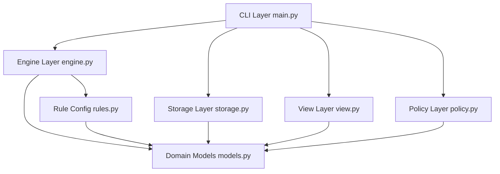
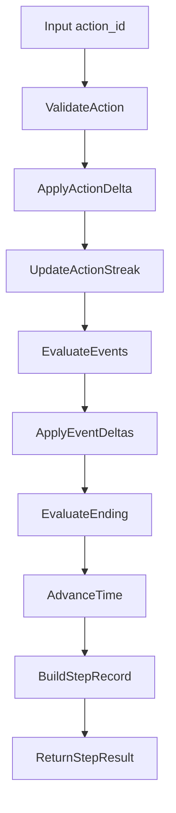
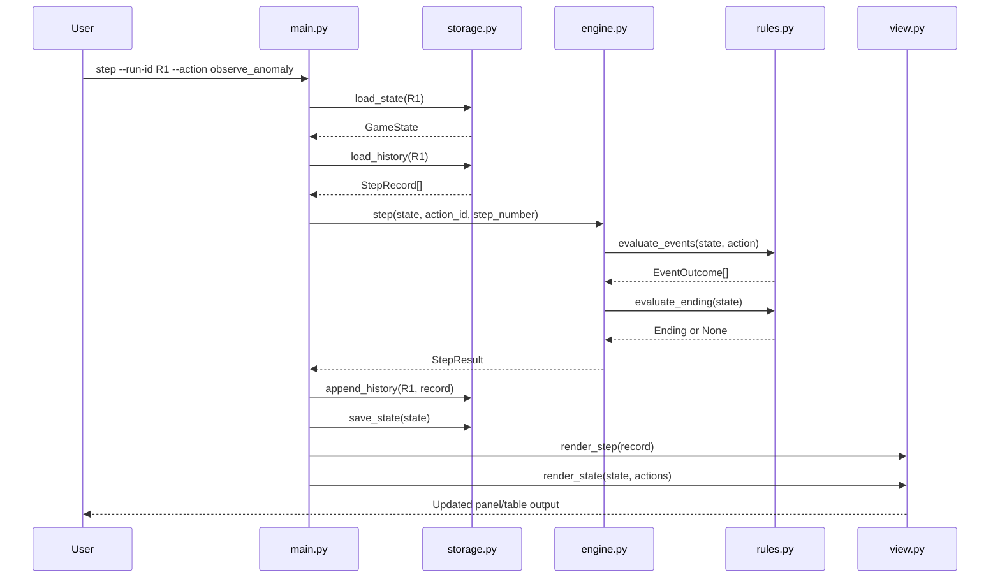

# Haruhi Loop CLI Architecture

[English](arch.md)
[简体中文](arch_zh-CN.md)

## 1. Goals

This project is a `Python + CLI` prototype built for fun. The design priorities are:

- Use “infinite loops + small accumulated changes” as the core mechanic.
- Keep the system explainable: every state transition must be traceable and replayable.
- Keep the system extensible: adding actions/events/endings should avoid engine rewrites.
- Keep the code maintainable: clear module boundaries and low coupling.

## 2. Layered Architecture



Layer responsibilities:

- `CLI Layer`: parse commands, orchestrate execution, and manage user-facing errors.
- `Engine Layer`: advance state, apply events, and evaluate endings (core business logic).
- `Rule Config`: action table, event conditions, and ending conditions.
- `Storage Layer`: runtime persistence and history logs.
- `View Layer`: terminal rendering through Rich only.
- `Policy Layer`: pluggable strategy interface (future RL integration point).
- `Domain Models`: shared typed structures and serialization boundaries.

## 3. File Responsibilities

```text
src/haruhi_cli/
  __init__.py      # Package marker
  main.py          # Typer command definitions and orchestration
  models.py        # Domain models (state/action/event/ending/step record)
  engine.py        # Core state machine and step lifecycle
  rules.py         # Table-driven actions and rule evaluation
  storage.py       # state.json + history.jsonl persistence
  view.py          # Rich-based terminal rendering
  policy.py        # Policy protocol and built-in strategies

tests/
  test_engine.py   # Determinism and closed-space trigger tests
  test_endings.py  # Ending reachability tests
```

## 4. Domain Model

### 4.1 `GameState`

Key fields:

- Time: `day`, `timeslot_index`, `loop_count`
- World status: `satisfaction`, `stability`, `clue_points`, `worldline_shift`
- Risk: `closed_space_count`
- Progress: `flags`, `recent_actions`, `current_action_streak`
- Final state: `ending_id`, `ending_title`

Design notes:

- `snapshot()` provides a stable, serializable state for persistence and replay diffs.
- `flags` is a scalable fact-set to avoid frequent schema changes.
- `timeslot` is derived from `timeslot_index` to reduce redundant storage.

### 4.2 `Action`, `EventOutcome`, and `Ending`

- `Action`: user-selectable behavior with state deltas.
- `EventOutcome`: rule-triggered side effects (e.g., Closed Space).
- `Ending`: terminal outcome object (`ending_id`, `title`, `description`).

### 4.3 `StepRecord`

Each step captures:

- pre-step and post-step snapshots
- selected action metadata
- triggered event list
- optional ending marker

This enables transparent replay and fast balancing/debugging loops.

## 5. Runtime Flow

Single-step logic (`engine.GameEngine.step`):



Execution order:

1. Validate action ID.
2. Apply direct action deltas.
3. Update streak counters for repeated actions.
4. Evaluate and apply triggered event outcomes.
5. Evaluate ending conditions.
6. Advance time and apply loop drift.
7. Build and return `StepRecord`.

## 6. Sequence Diagram (Command to Persistence)



## 7. Rule System and Extensibility

`rules.py` uses a “table + evaluator” pattern:

- `ACTIONS`: table-driven action definitions.
- `evaluate_events(state, action)`: dynamic event trigger function.
- `evaluate_ending(state)`: centralized ending evaluator.

Current examples:

- Repetition pressure: `boredom_spike`
- End-of-day drift: `day_end_drift`
- Instability trigger: `closed_space`
- Recovery branch: `closed_space_stabilized`

Current endings:

- `haruhi_happy_new_world`
- `kyon_breaks_loop`
- `shinirappears_unstable_world`

Extension strategy:

- Add new endings through `flags + threshold` combinations.
- Build multi-stage narrative chains by emitting and consuming flags.

## 8. CLI Command Surface

Commands in `main.py`:

- `start`: initialize a new run and persist initial state.
- `step --run-id --action`: execute one step and append history.
- `status --run-id`: print current state and action list.
- `history --run-id [--last N]`: inspect recent decision chain.
- `replay --run-id`: replay trajectory and print summary reason.
- `simulate --runs --max-steps --policy`: batch strategy simulation.

Command-layer principle:

- CLI orchestrates only; business rules stay in `engine + rules`.

## 9. Persistence and Replay

Per-run storage path: `.haruhi_runs/<run_id>/`

- `state.json`: latest snapshot (overwrite)
- `history.jsonl`: append-only step stream

Benefits:

- Fast status loading from `state.json`
- Full replay from `history.jsonl`
- Easy side-by-side comparison between strategies and parameter sets

## 10. Strategy Interface and RL Hook

`policy.py` defines the `Policy` protocol:

- Input: `state`, `actions`, `history`
- Output: chosen `action_id`

Built-in implementations:

- `RandomPolicy`: baseline random behavior
- `GreedyPolicy`: simple heuristic policy

Future RL path:

1. Add `RLPolicy` that satisfies the same protocol.
2. Wire `--policy rl` in `simulate`.
3. Keep training offline and inference online in CLI without architecture changes.

## 11. Testing Approach

Validation targets:

- Determinism: same action sequence -> same trajectory.
- Trigger correctness: low stability can trigger Closed Space.
- Ending reachability: all three endings can be reached in tests.

Test files:

- `tests/test_engine.py`
- `tests/test_endings.py`

Run command:

```bash
uv run pytest -q
```

## 12. Suggested Next Iterations

- Externalize actions/events/endings into JSON or YAML configs.
- Add parameter presets for demo-time difficulty switching.
- Add replay “milestone” highlighting (first Closed Space, first key flag).
- Keep engine/rules unchanged before introducing TUI to avoid UI-driven coupling.

