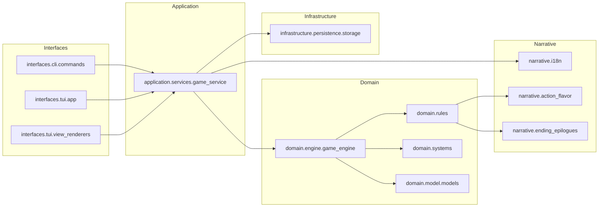

# HaruhiLoop Architecture

本文描述当前代码在“工程化分层重构第一阶段”后的结构：新增分层包，同时保留旧模块路径作为兼容门面。

## 1. 目标与边界

- 保持入口兼容：`haruhi` -> `haruhiloop_cli.main:app`，`haruhi-play` -> `haruhiloop_cli.play_app:run_play`
- 将业务编排从 CLI/TUI 入口下沉到应用层服务，降低 UI 层耦合
- 保持旧导入路径可用（测试与外部脚本不破坏）

## 2. 分层结构



## 3. 目录（当前实现）

```text
src/haruhiloop_cli/
  interfaces/
    cli/commands.py                  # CLI 命令实现（新入口实现）
    tui/app.py                       # TUI 兼容导出（第一阶段）
    tui/view_renderers.py            # Rich 渲染兼容导出（第一阶段）
  application/
    services/game_service.py         # start/step/status/replay/simulate 用例编排
  domain/
    engine/game_engine.py            # 引擎兼容导出（第一阶段）
    model/models.py                  # 模型兼容导出（第一阶段）
    rules/*.py                       # rules/policy/mutator/ending 条件兼容导出
    systems/*.py                     # v0.3 子系统兼容导出
  infrastructure/
    persistence/storage.py           # 持久化兼容导出
  narrative/
    i18n.py                          # 本地化兼容导出
    action_flavor.py                 # 动作文案兼容导出
    ending_epilogues.py              # 结局长剧情兼容导出

  main.py                            # 薄门面：转发到 interfaces.cli.commands.app
  play_app.py                        # 旧路径保留（当前仍含主要实现）
  view.py                            # 旧路径保留（当前仍含主要实现）
  engine.py/rules.py/models.py/...   # 旧路径保留（兼容）
```

## 4. 运行流（CLI）

1. `main.py` 仅暴露 `app`，实际命令在 `interfaces.cli.commands`
2. `commands.py` 负责参数校验、错误输出、渲染调用
3. 业务流程由 `GameService` 编排
4. `GameService` 调用 `GameEngine` 推进状态，并调用 `storage` 读写
5. `view_renderers` 输出 Rich 面板；`narrative.i18n` 负责文案格式化

## 5. 兼容策略

- 第一阶段不删除 `haruhiloop_cli.*` 旧模块路径
- 新分层模块主要以 re-export 方式建立稳定入口
- 现有测试可以继续从旧路径导入（包含 `_toggle_view_mode`、`_apply_noise`）

## 6. 演进建议（第二阶段）

- 将 `play_app.py` 与 `view.py` 的主体实现迁移到 `interfaces/tui/*`
- 将 `engine.py`、`rules.py`、`models.py` 主体实现迁移到 `domain/*` 并把旧文件收敛为纯门面
- 在一到两个 minor 版本后，再考虑为旧路径添加 `DeprecationWarning`

## 7. 验证与回归

- 单元测试：`uv run pytest -q`
- CLI 入口：`uv run haruhi --help`
- TUI 入口：`uv run haruhi-play`
- 兼容导入：`from haruhiloop_cli.play_app import run_play` 仍可用
