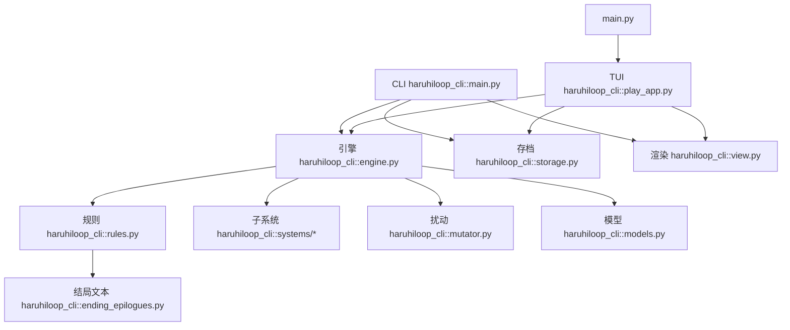

# Haruhi Loop 架构说明

[English](arch.md)
[简体中文](arch_zh-CN.md)

## 1. 当前范围

当前运行面包含：

- Typer CLI（`haruhi`）
- Textual TUI（`haruhi-play`）
- 共用模拟引擎与存档层

目标是保证：逻辑可回放、可测试，同时能持续扩展场景、选项、路线与叙事文本。

## 2. 分层关系



## 3. 关键文件

```text
src/haruhiloop_cli/
  main.py                  # CLI 命令
  play_app.py              # Textual 键盘界面
  engine.py                # 单步流程编排
  rules.py                 # 场景/选项池、事件与结局规则
  systems/
    homework.py            # 作业任务链
    crew.py                # 团员协同
    closed_space.py        # 闭锁阶段危机流
    memory.py              # 循环记忆残留
  mutator.py               # deterministic / ai 扰动 profile
  models.py                # 状态与记录模型
  storage.py               # state.json + history.jsonl
  view.py                  # Rich 展示（CLI/TUI 共用）
  ending_epilogues.py      # 结局长剧情
  ending_conditions_zh.py  # TUI 作弊查看文本
```

## 4. 引擎单步流程（Scene + Choice）

`GameEngine.step` 的顺序：

1. 校验 `scene_id + choice_id` 并生成步前快照
2. 应用选项增量（受 mutation profile 缩放）
3. 更新选择连击、路线推进、角色好感与世界线偏移
4. 执行子系统钩子（作业、协同、闭锁、记忆）
5. 执行规则事件（`evaluate_events`）
6. 应用所有事件增量
7. 判定结局并写入结局剧情
8. 推进时段/日期，并在跨天时刷新 profile
9. 生成包含 `scene/choice` 字段与 `mutation_profile` 的 `StepRecord`

## 5. 时间模型

- `TIMESLOTS = ("morning", "afternoon", "evening")`
- 每次 `step` 推进一个时段
- 傍晚步会触发日终漂移，随后进入下一天并增加 `loop_count`

## 6. 扰动模型

`mutator.py` 提供：

- `DeterministicMutator`
- `AIMutator`（本地伪 AI 扰动，不调用外部 API）
- `validate_profile`（对系数做安全钳制）

Profile 字段：

- `satisfaction_factor`
- `stability_factor`
- `clue_factor`

## 7. 持久化（破坏式版本）

每局路径：

```text
.haruhiloop_runs/<run_id>/
  state.json
  history.jsonl
```

- `state.json` 含 `schema_version`；当前仅接受版本 `2`，旧版本会直接报错。
- `history.jsonl` 中的 `StepRecord` 以 `scene_id/scene_label/choice_id/choice_label` 为核心字段。

## 8. 扩展建议

- 场景/选项/事件/结局继续集中在 `rules.py`
- 新机制优先放入 `systems/*`，再由 `engine.py` 编排
- `main.py` 与 `play_app.py` 保持薄层，不承载业务规则

## 9. 测试

当前覆盖重点：

- 引擎确定性与场景/选项解析（`tests/test_engine.py`）
- 结局可达性（`tests/test_endings.py`）
- v0.3 子系统（`tests/test_systems_v03.py`）
- 扰动与校验（`tests/test_mutator.py`）

运行：

```bash
uv run pytest -q
```
