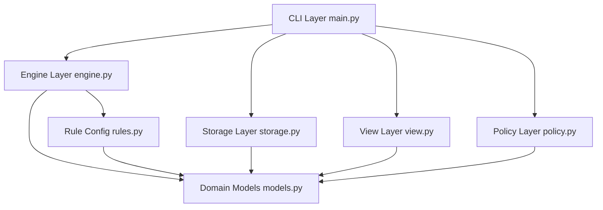
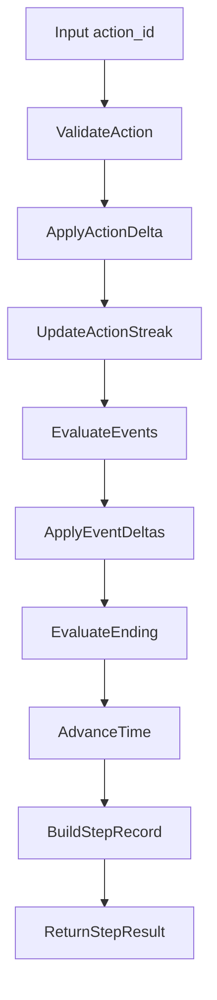
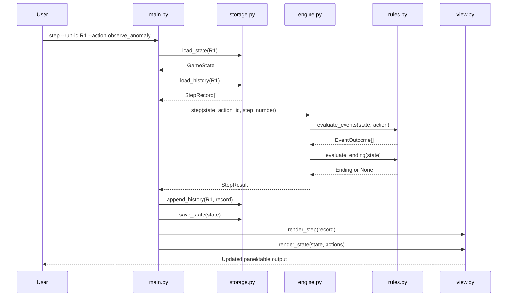

# Haruhi Loop CLI 架构说明

## 1. 设计目标

- 以“无限循环 + 微小变化累积”作为核心机制。
- 保持高可解释性：每一步状态变化都可追踪、可回放。
- 保持高可扩展性：新增动作、事件、结局时尽量不改引擎主干。
- 保持工程可维护性：模块边界清晰、耦合度低。

## 2. 分层架构



各层职责：

- `CLI Layer`：解析命令、编排执行流程、处理用户可见错误。
- `Engine Layer`：推进状态、应用事件、判定结局（核心业务逻辑）。
- `Rule Config`：动作表、事件条件、结局条件。
- `Storage Layer`：运行态持久化与历史日志读写。
- `View Layer`：基于 Rich 的终端渲染，不参与业务判定。
- `Policy Layer`：可插拔策略接口（后续 RL 接入点）。
- `Domain Models`：统一数据结构与序列化边界。

## 3. 文件职责

```text
src/haruhi_cli/
  __init__.py      # 包标记
  main.py          # Typer 命令定义与流程编排
  models.py        # 领域模型（状态/动作/事件/结局/步骤记录）
  engine.py        # 状态机主流程与单步生命周期
  rules.py         # 表驱动动作与规则判定
  storage.py       # state.json + history.jsonl 持久化
  view.py          # Rich 终端展示
  policy.py        # Policy 协议与内置策略

tests/
  test_engine.py   # 引擎确定性与闭锁空间触发测试
  test_endings.py  # 结局可达性测试
```

## 4. 领域模型

### 4.1 `GameState`

关键字段：

- 时间维度：`day`, `timeslot_index`, `loop_count`
- 世界状态：`satisfaction`, `stability`, `clue_points`, `worldline_shift`
- 风险状态：`closed_space_count`
- 进度状态：`flags`, `recent_actions`, `current_action_streak`
- 终局状态：`ending_id`, `ending_title`

设计要点：

- 通过 `snapshot()` 输出稳定可序列化快照，便于存档与回放差分。
- `flags` 作为可扩展事实集合，减少频繁改模型字段的需求。
- `timeslot` 由 `timeslot_index` 推导，避免冗余存储。

### 4.2 `Action`、`EventOutcome` 与 `Ending`

- `Action`：用户可选动作及其状态增量。
- `EventOutcome`：规则触发的附加影响（如闭锁空间）。
- `Ending`：终局对象（`ending_id`、`title`、`description`）。

### 4.3 `StepRecord`

每一步记录包含：

- 步前与步后快照
- 动作元信息
- 触发事件列表
- 可选结局标记

该结构保证了回放可解释性，也便于快速调参与排障。

## 5. 运行流程

单步逻辑（`engine.GameEngine.step`）：



执行顺序：

1. 校验动作 ID。
2. 应用动作直接增量。
3. 更新重复动作连击计数。
4. 评估并应用事件结果。
5. 判定是否触发结局。
6. 推进时段/日期并应用循环漂移。
7. 构建并返回 `StepRecord`。

## 6. 时序图（命令到持久化）



## 7. 规则系统与扩展方式

`rules.py` 采用“表 + 评估函数”模式：

- `ACTIONS`：表驱动动作定义。
- `evaluate_events(state, action)`：动态事件触发函数。
- `evaluate_ending(state)`：集中式结局判定函数。

当前规则示例：

- 重复动作压力：`boredom_spike`
- 日终漂移：`day_end_drift`
- 不稳定触发：`closed_space`
- 稳定化分支：`closed_space_stabilized`

当前结局：

- `haruhi_happy_new_world`
- `kyon_breaks_loop`
- `shinirappears_unstable_world`

扩展建议：

- 新增结局优先采用 `flags + threshold` 组合条件。
- 复杂叙事可拆为多段事件链（事件 A 产出 flag，事件 B 消耗 flag）。

## 8. CLI 命令面

`main.py` 中的命令：

- `start`：初始化新 run 并持久化初始状态。
- `step --run-id --action`：执行一步并写入历史。
- `status --run-id`：查看当前状态与可用动作。
- `history --run-id [--last N]`：查看最近决策链。
- `replay --run-id`：按轨迹回放并输出总结。
- `simulate --runs --max-steps --policy`：批量策略模拟。

命令层原则：

- CLI 只做编排；业务规则留在 `engine + rules`。

## 9. 持久化与回放

每个 run 存储于 `.haruhi_runs/<run_id>/`：

- `state.json`：最新快照（覆盖写）
- `history.jsonl`：步骤流日志（追加写）

收益：

- 从 `state.json` 快速恢复当前状态
- 从 `history.jsonl` 完整回放演化轨迹
- 便于策略对比与参数调优

## 10. 策略接口与 RL 预留

`policy.py` 定义 `Policy` 协议：

- 输入：`state`、`actions`、`history`
- 输出：选择的 `action_id`

内置实现：

- `RandomPolicy`：随机基线
- `GreedyPolicy`：启发式策略

后续 RL 接入路径：

1. 新增实现同协议的 `RLPolicy`。
2. 在 `simulate` 中接入 `--policy rl`。
3. 训练离线进行，CLI 在线推理，无需改现有主架构。

## 11. 测试策略

验证目标：

- 确定性：同动作序列得到同轨迹。
- 触发正确性：低稳定性可触发闭锁空间。
- 可达性：三个结局均能在测试中触发。

测试文件：

- `tests/test_engine.py`
- `tests/test_endings.py`

执行命令：

```bash
uv run pytest -q
```

## 12. 下一步演进建议

- 将动作/事件/结局外置为 JSON 或 YAML 配置。
- 增加参数预设，便于现场演示时切换难度。
- 在 replay 中增加“关键里程碑”高亮（首次闭锁空间、首次关键 flag）。
- 在接入 TUI 前保持 `engine/rules` 稳定，避免 UI 反向驱动业务耦合。

